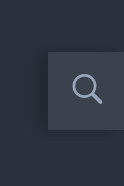
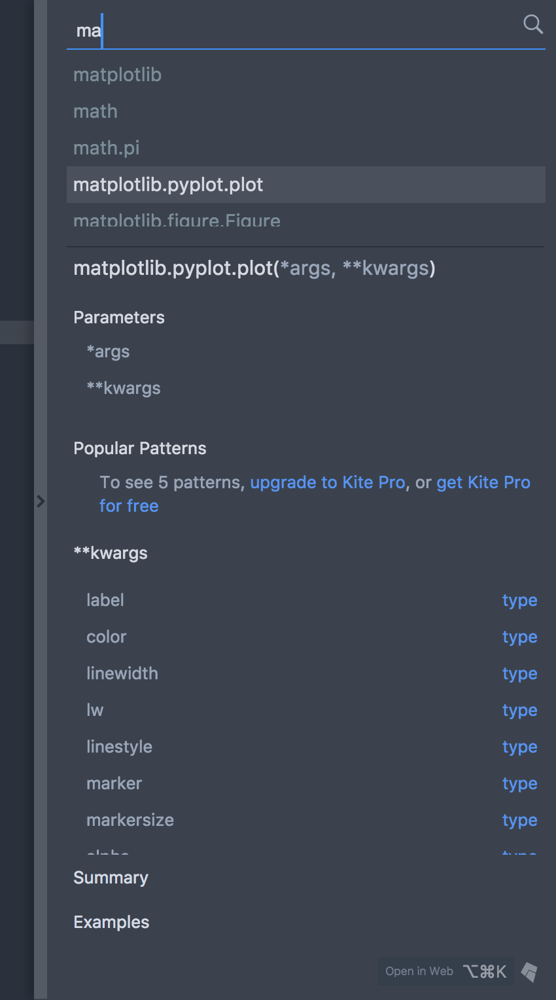

## Atom Kite Plugin Documentation

### Supported Atom Versions

All Atom versions greater than or equal to `v1.13.0` are supported.

### Supported Operating Systems

All OSes supported by Kite are also supported by the Atom Plugin, currently it supports:
- OSX (10.10 and higher)
- Windows (7 and higher)

### Supported languages

The plugin's features are only available in file types supported by the Kite engine:

- Python: All files with a `.py` extension are supported.

### Install

The Atom plugin is installed automatically by Kite if you have activated it for Atom.
It can still be installed manually either by searching for `kite` in the install package search input or by running `apm install kite` in your terminal.

### Startup

When starting Atom with Kite's plugin for the first time, the Kite's tour will be displayed in the active pane.

This tour will only be displayed once, if you want to see it again on next startup you can activate the `Show Kite Tour On Startup` setting.

### Status Bar

The Kite icon in the status bar displays the state of Kite for the current file.

TODO

### Editor Features

#### Hover documentation

When you move the mouse over a symbol, Kite can display some popup with a quick summary of what this symbol represent and links to additional documentation.

You can see up to three links in the popup:

- `def` will open the file where this symbol is defined
- `web` will open the symbol documentation page in your browser
- `more` will open the [Kite sidebar panel](#sidebar-panel) with additional documentation for this symbol

#### Context Menu

Kite plugin also provides contextual menus with actions related to the symbol below the mouse.

#### Completions

Kite's Atom plugin exposes an `autocomplete-plus` provider. When in a supported file, you'll be able to see Kite's suggestions as well as some additional documentation and links in the `autocomplete-plus` panel.

The links at the bottom have the same behaviour than those in the [hover UI](#hover-documentation).

#### Functions Signatures

When typing inside a function's parentheses the Kite plugin will display the function signature with information regarding the current argument and links to additional documentation.

The links at the bottom have the same behaviour than those in the [hover UI](#hover-documentation).

#### Sidebar Panel

The Kite sidebar panel offer a more detailed view of a symbol documentation. You can use the sidebar panel to browse the members of a module or a type, or to access curated examples, Stack Overflow topics, and more.

#### Active Search

When working in a supported file, this small overlay will be displayed at the bottom right of the workspace.

Clicking on it will expand Kite's active search. It allows you to search in Kite's documentation at any moment.

### Commands

The Kite plugin exposes many commands so that you can setup your own keybindings for them.

|Command|Description|
|---|---|
|`kite:active-search`|Expand the active search panel.|
|`kite:expand-at-cursor`|When the cursor is inside a symbol this command will open the sidebar panel with the symbol's documentation.|
|`kite:open-permissions`|Opens Kite's permissions into your browser.|
|`kite:open-settings`|Opens Kite's settingsg into your browser.|
|`kite:open-sidebar`|Opens Kite's sidebar panel.|
|`kite:close-sidebar`|Closes Kite's sidebar panel.|
|`kite:toggle-sidebar`|Toggle Kite's sidebar panel.|

### Settings

|Setting|Description|
|---|---|
|`Show Kite Tour On Startup`|Whether to display the Kite tour on startup.|
|`Enable Completions`|Show auto-completions from Kite as Atom suggestions.|
|`Enable Hover UI`|Show hover informations when placing the mouse over a symbol|
|`Display Expand View As`|This setting defines how the Kite expanded view will be displayed in Atom.|
|`Sidebar Position`|When `Display Expand View As` is set to `sidebar` this setting defines where to place the sidebar in the Atom UI.|
|`Sidebar Width`|When `Display Expand View As` is set to `sidebar` this setting defines the width of the sidebar.|
|`Use Dock For Sidebar`|When the dock API is available in your Atom version Kite will use it to display the sidebar panel.|
|`Open Sidebar On Startup`|When `Display Expand View As` is set to `sidebar` this setting will make the sidebar appears on startup.|
|`Max Visible Suggestions Along Signature`|When both signature and completions are displayed at the same time, this setting controls the maximum number of suggestions visible.|
|`Active Search Position`|Controls where the active search collapsed panel is displayed.|
|`Hide Documentation When Signature Is Available`|If both a signature and documentation is available at the same only the signature will be visible.|
|`Collapse Long Summaries`|Whether to collapse or not long summaries in the sidebar panel.|
|`Polling Interval`|The interval between status checks for the active file.|
|`Logging Level`|The verbosity level of Kite's logs.|
|`Developer Mode`|Enable Kite developer mode, displaying received data in the various UIs.|
